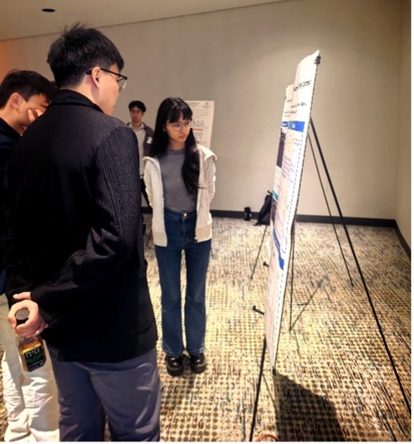
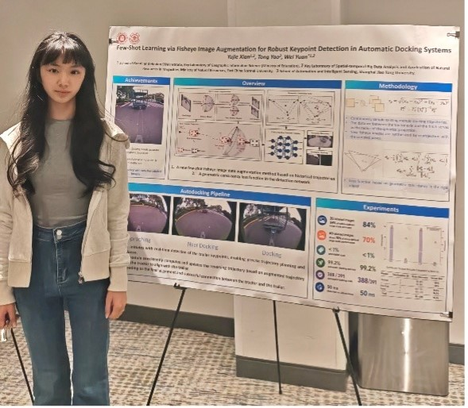
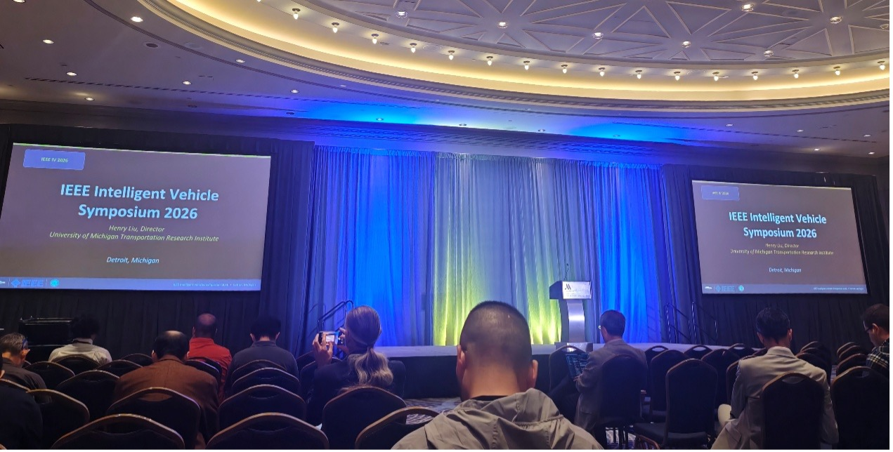
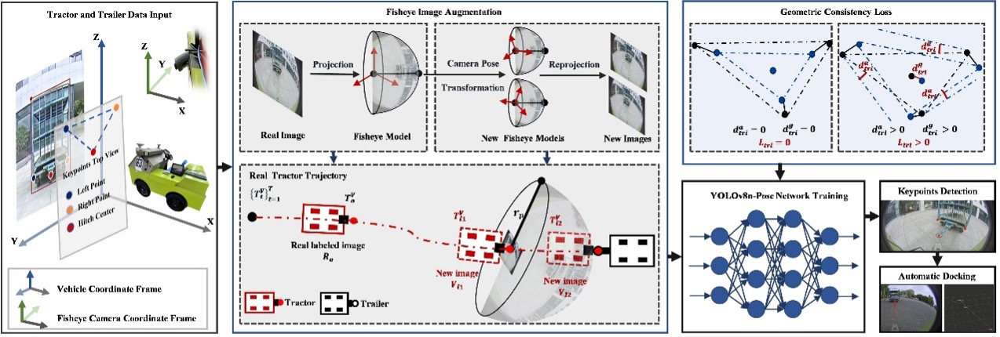



<!-- Education
======
* Ph.D in Control Science and Engineering, Shanghai Jiao Tong University, 2017-2021
* M.S. in Control Engineering, Shanghai Jiao Tong University, 2014-2017
* B.S. in Flight Vehicle Propulsion Engineering, Nanjing University of Aeronautics and Astronautics, 2010-2014

Work experience
======

* 2025-Now: Assistant Professor
  * School of Geospatial Artificial Intelligence, East China Normal University

* 2021-2025: Postdoc Researcher
  * UM-SJTU JI & Global Institute of Future Technology, Shanghai Jiao Tong University

* 2021-2025: Assistant to the Deputy General Manager of Tech Center (Part time)
  * SAIC GM Wuling Automobile Co., Ltd
   -->

<!-- * Summer 2015: Research Assistant
  * GitHub University
  * Duties included: Tagging issues
  * Supervisor: Professor Git -->
  
<!-- Skills
======
* Skill 1
* Skill 2
  * Sub-skill 2.1
  * Sub-skill 2.2
  * Sub-skill 2.3
* Skill 3 -->

News
======

## 团队论文被 IEEE Intelligent Vehicles Symposium 2026 录用并作海报展示
## Team Paper Accepted to IEEE IV 2026 and Presented as a Poster
2026-07-04

2026年国际智能车辆大会（IEEE Intelligent Vehicles Symposium 2026，IEEE IV 2026）于6月22日至6月25日在美国密歇根州底特律（Detroit Marriott at the Renaissance Center）举行。华东师范大学空间人工智能学院袁伟老师团队硕士研究生先宇洁参加本次会议，并以海报（Poster）形式展示论文《Few-Shot Learning via Fisheye Image Augmentation for Robust Keypoint Detection in Automatic Docking Systems》。

  
  <figcaption style="text-align:center;"> </figcaption>

  <figure style="margin:0; text-align:center;">
    
  </figure>

  <figure style="margin:0; text-align:center;">
    
  </figure>

IEEE IV 是智能车辆领域最具影响力的国际学术会议之一，汇聚了来自全球高校、科研院所、企业及政府机构的专家学者、工程师和青年科研人员，围绕智能车辆、自动驾驶、车辆感知、车路协同、智能交通系统等前沿方向开展深入交流，集中展示该领域的最新研究成果与技术进展。

  
  <figcaption style="text-align:center;"> </figcaption>

本次展示的论文由华东师范大学与上海交通大学合作完成，面向自动驾驶与智慧物流场景中的自动挂接任务，聚焦拖挂车辆倒车挂接过程中的关键点检测问题。针对传统方法依赖昂贵三维传感器或大规模标注数据、部署成本较高等问题，论文提出了一种基于历史轨迹的鱼眼图像增强少样本学习方法。实验结果表明，该方法在显著降低数据标注成本的同时，仍能够保持优异的关键点检测性能，并在真实自动挂接系统中实现了99.2%的挂接成功率，验证了方法在实际应用中的有效性与工程价值，并成功应用于上汽通用五菱无人物流车等项目。

  
  <figcaption style="text-align:center;"> </figcaption>

会议期间，先宇洁围绕论文的研究背景、方法设计、实验验证及系统应用进行了海报展示，并与来自国内外高校、科研机构的专家学者及青年科研人员进行了深入交流，围绕少样本学习、低成本车载感知、自动驾驶感知技术以及智能车辆等前沿方向展开了广泛讨论。此次参会进一步拓展了先宇洁的国际学术视野，加深了其对智能车辆领域前沿技术发展趋势的理解，也为后续科研和工程工作的深入开展积累了宝贵经验。
作为智能车辆领域的重要国际学术会议，IEEE IV 持续推动自动驾驶、智能车辆、车路协同及智能交通系统等方向的创新发展，为全球科研人员提供了高水平的学术交流平台。此次论文入选并完成展示，充分体现了团队在智能驾驶与智能感知领域的持续研究进展，也进一步提升了团队在国际学术舞台上的学术影响力。

# English Summary: 
A paper from Dr. Wei Yuan's research group at the School of Geospatial Artificial Intelligence, East China Normal University, was accepted to the 2026 IEEE Intelligent Vehicles Symposium (IEEE IV 2026) and presented in the Poster Session. The research proposes a few-shot learning framework based on fisheye image augmentation for robust keypoint detection in autonomous docking systems. The method significantly reduces annotation costs while achieving a 99.2% docking success rate in a real-world autonomous docking platform. The work has also been deployed in autonomous logistics vehicle projects with SAIC-GM-Wuling. During the conference, the team exchanged ideas with researchers worldwide on intelligent vehicles, autonomous driving, and vehicle perception, further strengthening its international academic visibility.

<!-- Publications
======
  <ul>
    
  </ul> -->
  
<!-- Talks
======
  <ul>
    
  </ul> -->
  
<!-- Teaching
======
  <ul>
    
  </ul> -->
  
<!-- Service and leadership
======
* Currently signed in to 43 different slack teams -->
