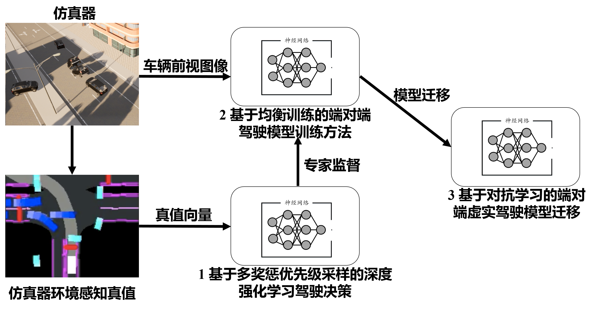
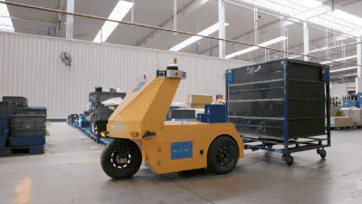



My research primarily encompasses perception, decision-making, planning, and control in autonomous driving. All of my research efforts are implemented in real-world applications, as I firmly believe that true research value can only be realized through practical deployment.

Researches
======

* 2023.01–2025.12: National Natural Science Foundation of China(62203301)
  * Research on End-to-End Learning Method of Intelligent Vehicle based on  Virtual-Real Transfer

  
  <figcaption style="text-align:center;">Framework of the NSFC project</figcaption>

* 2021.06-2024.06：Shanghai Talent Development Fund. 
  * Research on key technologies of unmanned logistics vehicles for industrial parks

  
  <figcaption style="text-align:center;">Framework of the ShanghaiTalent project</figcaption>

* 2021.06–2024.12: 
  * Led a Research on smart delivery takeaway unmanned vehicle

* 2023.06-2024.12:
  * Participate in the Project of Design and development of new energy intelligent networked vehicle software code

* 2022.06–2023.06: 
  * Participate in the Project of Adaptation of 100 Shanghai Jiao Tong University system unmanned logistics vehicles

* 2022.06–2023.06: 
  * Participate in the Project of Unmanned Driving System - intelligent networked vehicle decision planning design and development

* 2019.12–2021.06: 
  * Participate in the Project of 5G cloud-controlled unmanned logistics vehicle intelligent system

Applications
======

* Self-driving logistic vehicles: 
  * My team has developed full-stack software and algorithms for unmanned logistics vehicles, and has implemented the use of more than 300 unmanned logistics vehicles in multiple factories, including SAIC-GM-Wuling and CATL's Sichuan factory.

  
  <figcaption style="text-align:center;">Real deployment of the self-driving logistic vehicles</figcaption>

* Perception-based unmanned forklift:
  * Traditional unmanned forklifts rely heavily on high-precision positioning to operate. My team has developed a perception-based unmanned forklift based on non-repetitive scanning technology. This technology, combined with natural positioning accuracy of approximately 5cm, allows for an operational accuracy of 2cm. This system is being used for outdoor forklift unloading at SAIC-GM-Wuling.

  
  <figcaption style="text-align:center;">Real deployment of the autonomous forklift</figcaption>

* Finished vehicle transfer vehicle: 
  * Traditionally, finished cars need to be manually transported after they roll off the assembly line, which is time-consuming and labor-intensive. Our team has developed a transport vehicle that can achieve both indoor and outdoor navigation and is used in SAIC-GM-Wuling's island-style factory.

  
  <figcaption style="text-align:center;">Real deployment of the transfer vehicles</figcaption>

* Unmanned sweeper: 
  * Natural navigation and autonomous cleaning of small cleaning robots based on top-view lidar

  
  <figcaption style="text-align:center;">Demo of the autonous sweeper</figcaption>

* Unmanned logistics full chain: 
  * Based on unmanned forklifts, unmanned logistics vehicles and AGVs, the whole chain of logistics work from unmanned forklift unloading, unmanned logistics vehicle transfer, to AGV online operation is realized, and it is applied to the engine manufacturing line of SAIC General Materials

  
  <figcaption style="text-align:center;">Demo of the logistics full chain</figcaption>

