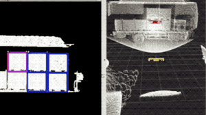



My research primarily focuses on **perception**, **decision-making**, **planning**, and **control** in autonomous driving.  
All of my research is closely connected to **real-world applications**, as I firmly believe that the true value of research lies in its practical deployment and societal impact.

---

## Research Projects

* **2023.01–2025.12:** National Natural Science Foundation of China (No. 62203301)  
  * *Research on End-to-End Learning Methods for Intelligent Vehicles Based on Virtual–Real Transfer*

  
  <figcaption style="text-align:center;">Framework of the NSFC project</figcaption>

* **2021.06–2024.06:** Shanghai Talent Development Fund  
  * *Research on Key Technologies of Unmanned Logistics Vehicles for Industrial Parks*

  
  <figcaption style="text-align:center;">Framework of the Shanghai Talent project</figcaption>

* **2021.06–2024.12:**  
  * *Principal Investigator, Research on Smart Takeaway Delivery Unmanned Vehicles*

* **2023.06–2024.12:**  
  * *Technical Lead, Project on the Design and Development of Software Systems for New Energy Intelligent Connected Vehicles*

* **2022.06–2023.06:**  
  * *Technical Lead, Project on the Deployment and Adaptation of 100 Unmanned Logistics Vehicles for Shanghai Jiao Tong University*

* **2022.06–2023.06:**  
  * *Technical Lead, Project on Decision-Making and Planning Systems for Intelligent Connected Vehicles*

* **2019.12–2021.06:**  
  * *Technical Lead, Project on 5G Cloud-Controlled Unmanned Logistics Vehicle Intelligent Systems*

---

## Industrial Applications

* **Self-Driving Logistics Vehicles**  
  * My team has developed full-stack software and algorithms for unmanned logistics vehicles, achieving large-scale deployment of **over 300 vehicles** across multiple factories, including **SAIC-GM-Wuling** and **CATL’s Sichuan plant**.

  
  <figcaption style="text-align:center;">Real-world deployment of self-driving logistics vehicles</figcaption>

* **Perception-Based Autonomous Forklifts**  
  * Traditional unmanned forklifts rely heavily on high-precision localization systems.  
    My team developed a **perception-driven autonomous forklift** using non-repetitive LiDAR scanning technology.  
    This system achieves a **natural localization accuracy of ~5 cm** and an **operational precision of 2 cm**, and is currently deployed for outdoor unloading operations at **SAIC-GM-Wuling**.

  
  <figcaption style="text-align:center;">Deployment of the perception-based autonomous forklift</figcaption>

* **Finished Vehicle Transfer Robots**  
  * Traditionally, finished cars are manually moved after rolling off the production line, which is time-consuming and labor-intensive.  
    Our team developed an **indoor–outdoor navigation transport robot** capable of autonomously transferring finished vehicles, currently operating at **SAIC-GM-Wuling’s island-style plant**.

  
  <figcaption style="text-align:center;">Deployment of the finished vehicle transfer robot</figcaption>

* **Autonomous Sweeper Robots**  
  * Developed a compact **autonomous cleaning robot** equipped with top-view LiDAR for natural navigation and automatic cleaning in complex environments.

  
  <figcaption style="text-align:center;">Demonstration of the autonomous sweeper</figcaption>

* **Unmanned Logistics Full Chain**  
  * By integrating **autonomous forklifts**, **unmanned logistics vehicles**, and **AGVs**, our system enables a **fully automated logistics chain**—from unloading, to material transfer, to in-line AGV operation—currently deployed on **SAIC’s engine manufacturing line**.

  
  <figcaption style="text-align:center;">Demonstration of the full-chain unmanned logistics system</figcaption>

