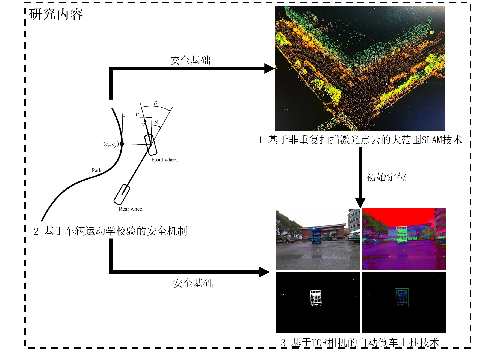



My research primarily encompasses perception, decision-making, planning, and control in autonomous driving. All of my research efforts are implemented in real-world applications, as I firmly believe that true research value can only be realized through practical deployment.

Researches
======

* 2023.01–2025.12: National Natural Science Foundation of China(62203301)
  * Research on End-to-End Learning Method of Intelligent Vehicle based on  Virtual-Real Transfer

  
  <figcaption>Framework of the NSFC project</figcaption>

* 2021.06-2024.06：Shanghai Talent Development Fund. 
  * Research on key technologies of unmanned logistics vehicles for industrial parks

  

Applications
======

* 2021.06–2024.12: 
  * Led a Research on smart delivery takeaway unmanned vehicle

  

* 2023.06-2024.12:
  * Participate in the Project of Design and development of new energy intelligent networked vehicle software code

  

* 2022.06–2023.06: 
  * Participate in the Project of Adaptation of 100 Shanghai Jiao Tong University system unmanned logistics vehicles

  

* 2022.06–2023.06: 
  * Participate in the Project of Unmanned Driving System - intelligent networked vehicle decision planning design and development

  

* 2019.12–2021.06: 
  * Participate in the Project of 5G cloud-controlled unmanned logistics vehicle intelligent system

  

